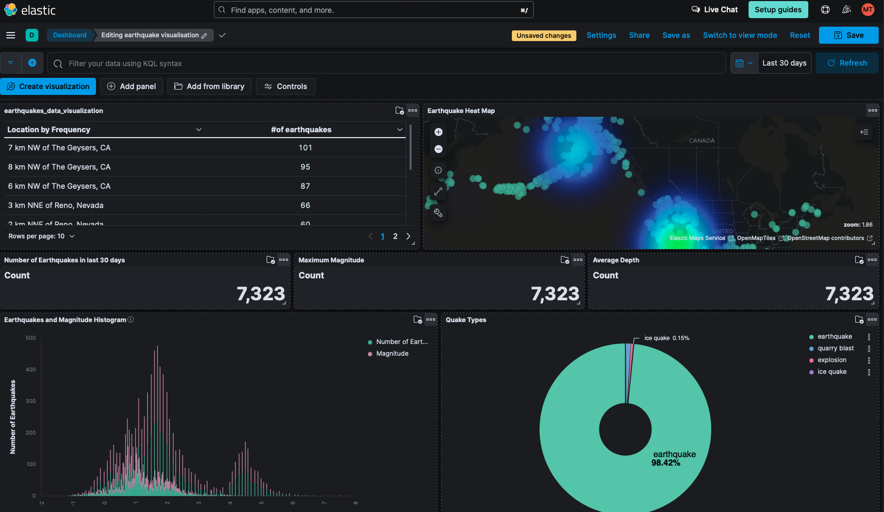
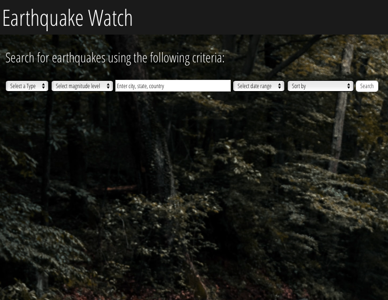

Earthquake Explorer

Uncover the mysteries beneath the Earth's surface with Earthquake Explorer – an innovative application fusing Elasticsearch's powerful search capabilities and a frontend crafted with the latest React technologies.

Backend (Server):
Dependencies: Express, Axios, ElasticSearch, Config, Cors, Log Timestamp, Nodemon

Client (Frontend):
Dependencies: React, Axios, Testing Library, React Scripts, Web Vitals

Key Features:

Elasticsearch Integration: Harness the unparalleled search capabilities of Elasticsearch to provide lightning-fast and accurate results. Earthquake Explorer leverages Elasticsearch to sift through vast datasets effortlessly.

Kibana Visualization: Dive deep into seismic data with Kibana, the powerful visualization tool that transforms raw Elasticsearch data into insightful and interactive visualizations. Earthquake Explorer brings you rich, customizable visual representations for a comprehensive understanding of earthquake patterns.
Description:

Earthquake Explorer marries the efficiency of Elasticsearch with the elegance of React to deliver a seismic exploration like no other. Dive into real-time earthquake data with Elasticsearch's robust search engine, while Kibana on the frontend ensures a user-friendly and engaging experience through dynamic visualizations.

Experience seismic events like never before, with Kibana's powerful visualization tools providing a window into the Earth's movements. Stay informed, stay engaged – Earthquake Explorer is your compass in the seismic landscape.

Key Features:

Real-time earthquake data
Interactive and responsive frontend
Elasticsearch for powerful and efficient searches
Kibana visualization for insightful data interpretation
Testing infrastructure for code reliability
Continuous updates with Nodemon during development
Embark on a journey to explore earthquakes uniquely and intelligently. Earthquake Explorer – where Elasticsearch meets Kibana for your personalized seismic adventure.

